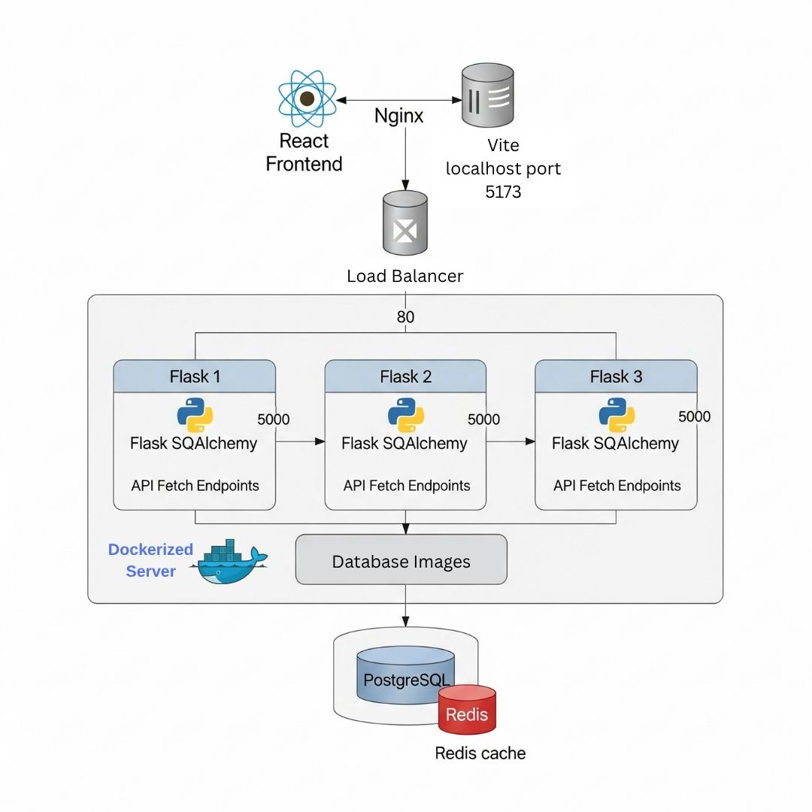

# BlogSphere

## Architecture
<div align="center">

</div>

## Setup 
Open the repository
```
cd ./BlogSphere
```
### Frontend
Under development
1) access client
```
cd ./client
```
2) Install Dependencies
```
npm install
```
3) Run Frontend
```
npm run dev
```

### Backend

1) Access server directory
```
cd ./server
```
2) Install Docker and start the Docker Engine

The backend is served completely using docker - flask, postgres, redis. Postgres database is used to store user data and redis is used for server side session management.

4) Put your  <SECRET_KEY>, <POSTGRES_USER>, <POSTGRES_PASSWORD> in ```.env``` and do not forget to add file to ```.gitignore```

The secret key will be used by flask server and postgres_user and postgres_password are the password you want to have for your postgres database.

5) Run the services
```
docker compose up -d
```

6) To Stop the server
```
docker compose down
```

Access the application at ```http://localhost:5173/```


## Functionalities

1. Secure Backend: Backend services are not exposed outside Docker except via NGINX.
2. Fast React Frontend: Built with Vite and React Router for fast, modern navigation.
3. PostgreSQL Database: Stores user accounts, blog posts, and related metadata.
4. Redis Caching: Used for caching frequently accessed blog data and managing sessions.
5. NGINX Reverse Proxy + Load Balancer: Handles routing and distributes requests across multiple Flask containers (round-robin).
6. Personalized Blog Admin Panel: Authenticated users can create, edit, and delete blogs from a personal dashboard.

### Demo
Watch Application demo at ```./main/demo.mp4```
